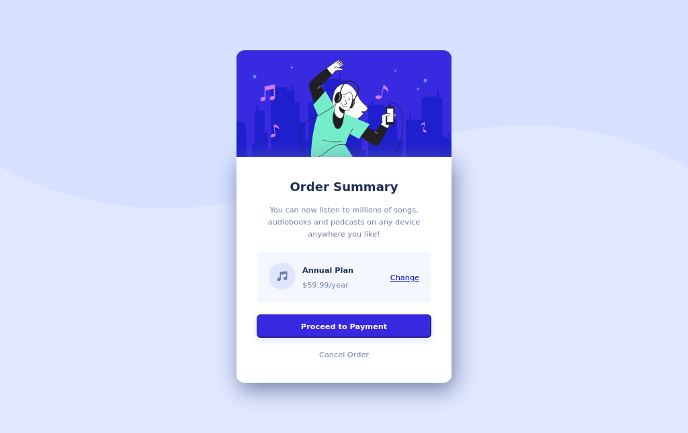

# Frontend Mentor - Order summary card solution

This is a solution to the [Order summary card challenge on Frontend Mentor](https://www.frontendmentor.io/challenges/order-summary-component-QlPmajDUj). Frontend Mentor challenges help you improve your coding skills by building realistic projects.

## Table of contents

- [Overview](#overview)
  - [The challenge](#the-challenge)
  - [Screenshot](#screenshot)
  - [Links](#links)
- [My process](#my-process)
  - [Built with](#built-with)
  - [Continued development](#continued-development)
- [Author](#author)

## Overview

### The challenge

Users should be able to:

- See hover states for interactive elements

### Screenshot

#### Desktop

#### Mobile

### Links

- Solution URL: [Github Pages](https://ak-chp1.github.io/fm_order_summary_component/)
- Live Site URL: [Github](https://github.com/ak-chp1/fm_order_summary_component)

## My process

### Built with

- Semantic HTML5 markup
- CSS custom properties
- Flexbox

### Continued development

It's box shadow still needs to be fixed

## Author

- Name - Aayush Kumar
- Frontend Mentor - [@ak-chp1](https://www.frontendmentor.io/profile/ak-chp1)

## Acknowledgements

I am very thankful to [@AdrianoEscarabote](https://www.frontendmentor.io/profile/AdrianoEscarabote) and [@Deevyn9](https://www.frontendmentor.io/profile/Deevyn9) from FrontendMentor on advising me on improving background-image and card width.
